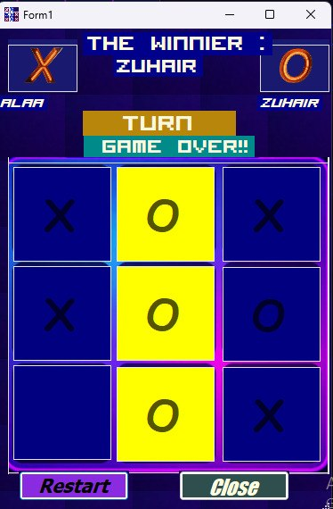
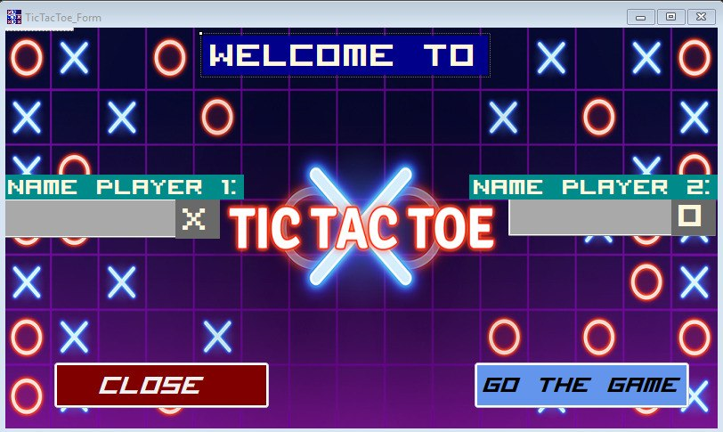

# 🎮 Tic Tac Toe Game (C# WinForms)

An interactive desktop application built with **C#** and **Windows Forms**. This project is a modern take on the classic Tic Tac Toe game, featuring a vibrant neon-style UI and smooth player interaction.

---

## 📝 About the Project
This application was developed to demonstrate game logic implementation in **Windows Forms**, handling user inputs (TextBoxes and Buttons), and managing transitions between the welcome screen and the main game arena.

> **⚠️ NOTE:** This repository showcases the **UI/UX design** and the **Game Engine** logic. It is designed for two players on the same machine.

---

## ✨ Key Features
* **Neon Aesthetic UI:** A visually striking dark-themed interface with glowing "X" and "O" elements.
* **Player Personalization:** * Custom name entry for Player 1 (X) and Player 2 (O).
* **Dynamic Game Logic:** * Automatic win detection (Horizontal, Vertical, and Diagonal).
    * Draw/Tie state handling.
* **Intuitive Navigation:** Simple "Go to Game" and "Close" controls for a seamless experience.
* **Responsive Interaction:** Real-time visual feedback when a player makes a move.

---

## 📸 Project Preview

  
  

---

## 🧪 How to Test the Application
You don't need Visual Studio to play! Follow these steps for a **Quick Trial**:

1.  **Download:** Download the file named `Tic-Tac-Toe_EXE.zip`.
2.  **Extract:** and extract it to your computer.
3.  **Run:** Open the folder and double-click `Tic-Tac-Toe_Game.exe`.
4.  **Play:** Enter your names, hit "GO THE GAME", and challenge a friend!

---

## 🛠 Tech Stack
* **Language:** C# (#CSharp)
* **UI Framework:** Windows Forms (WinForms)
* **IDE:** Visual Studio 2019
* **Platform:** .NET Framework / .NET Core

---

## 👨‍💻 Installation for Developers
If you want to explore the source code:
1.  Download the repository or the `Tic-Tac-Toe Game.zip` containing the source files.
2.  Open the `.sln` file in **Visual Studio**.
3.  Build the solution to ensure all assets are linked.
4.  Press **F5** to run and debug.

---

### 🤝 Feedback
I’m always looking to improve! If you have any suggestions or find a bug, feel free to open an *Issue* or reach out.

*Created with ❤️ by a Passionate .NET Student.*
